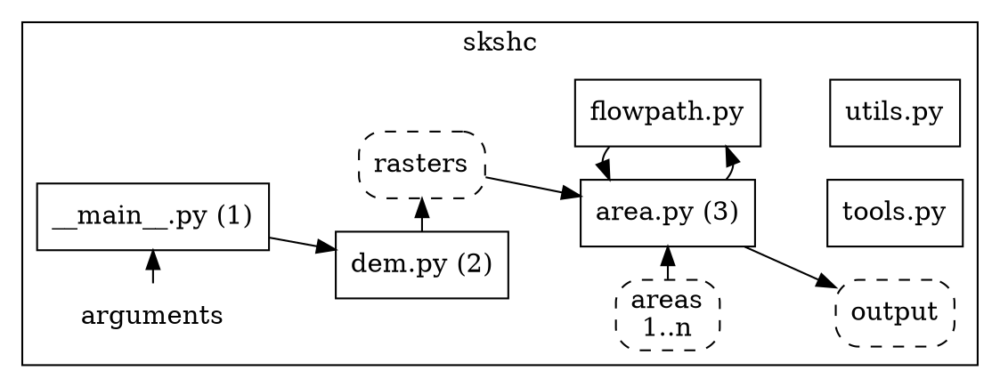

# Implementering

Verktyget utgörs av ett Python-paket med en huvudmodul och ett par hjälpmoduler
för körning av hela processen från början till slut. Programmet körs med
konfiguration som anges via argument eller fil.

1. Läs argument/konfigurationsfil
2. Kör modul `dem.py` för att förbereda hydrologisk höjdmodell och andra raster för hela analysområdet
3. Starta modul `area.py` för bearbetning av ett eller flera avverkningsområden (polygoner)

Normalfallet är att steg 2 körs en gång för att producera ett resultat som kan
användas av steg 3 upprepade gånger. En cache-funktion används för att
möjliggöra återanvändning av intermediära data. Resultatet från steg 3 kan
läggas till befintliga dataset.

Detaljerade instruktioner om körning av verktyget hittas i dokumentet
`README.md` i roten av verktygets utvecklingskatalog (GIT repository).

## Bibliotek

### WhiteboxTools

- [Vad är WhiteboxTools?](https://www.whiteboxgeo.com/geospatial-software/)
  - Öppen källkod - Rust
  - Python interface (wrapper till binär)
  - Hydrologiska verktyg
  - Begränsat stöd vektordataformat - ESRI Shape
- [Manual](https://www.whiteboxgeo.com/manual/wbt_book/preface.html)

### Övriga geospatiala

- [Geopandas](https://geopandas.org) (vektor)
- [Rasterio](https://rasterio.readthedocs.io) (raster)
- [rasterstats](https://pythonhosted.org/rasterstats/) (raster)

Samtliga tre bygger i grunden på [GDAL](https://gdal.org/) och av den anledningen har Conda använts som Python-pakethanterare för att underlätta installation av GDAL.
