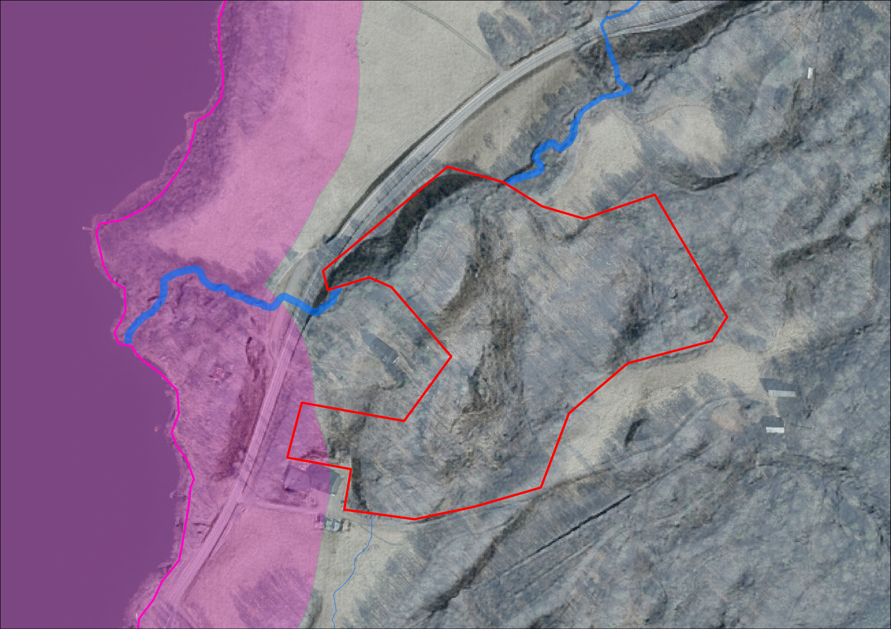
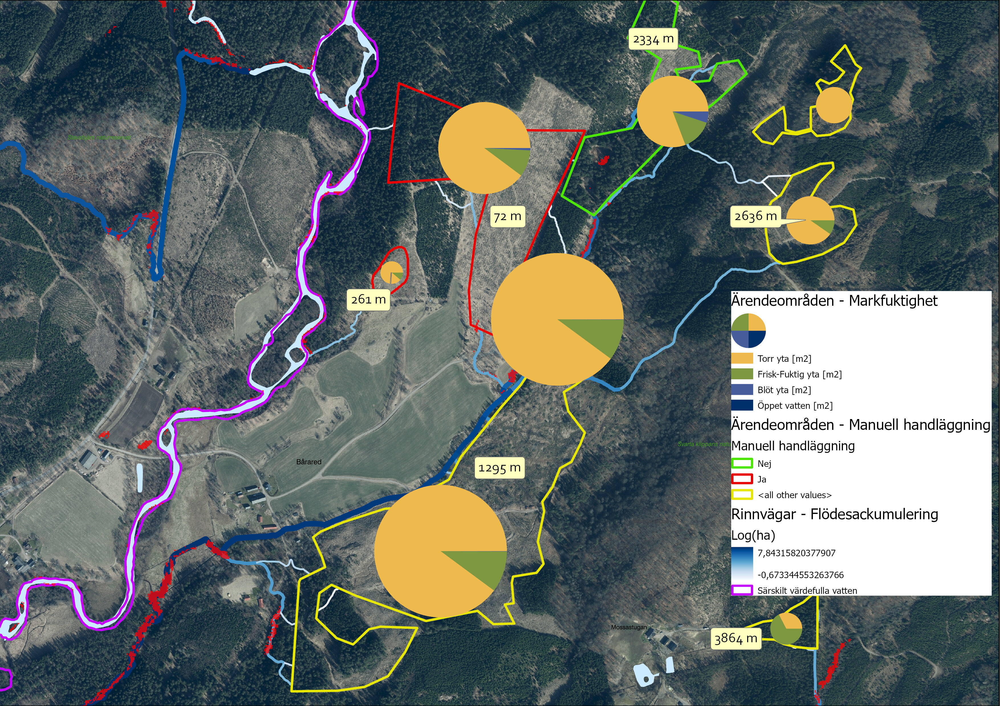
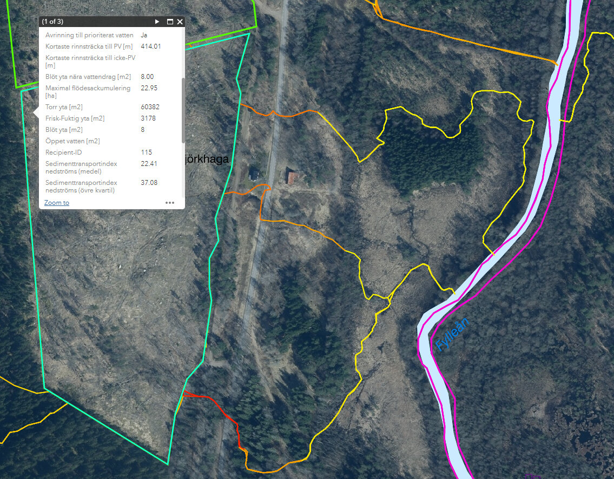

# Introduktion

Det här dokumentet beskriver ett verktyg som tagits fram inom projektet Grip on
Life och som ska utgöra verksamhetsstöd i Skogsstyrelsens handläggning av
avverkningsärenden inom och i anslutning till prioritierade vattendrag som kan
omfattas av t.ex. Natura 2000.

Grundläggande är att verktyget ska ge ökad förståelse för hur vatten rör sig i
landskapet och pekar ut ärenden/områden där det finns förhöjd risk för negativ
påverkan av vattenkvalitet. Detta är egenskaper som är värdefulla i många av
Skogsstyrelsens olika verksamheter och uppdrag.

Den uppenbara nyttan med verktyget är att använda det i Skogsstyrelsens
tillsynsverksamhet. Dels för att förfina den automatiska analys som görs av
ärenden men även tillhandahålla ett bättre visuellt underlag i de ärenden som
handläggs manuellt. Ett tydligt visuellt underlag underlättar samverkan med
andra myndigheter och skogliga aktörer.

## Bakgrund

### Påverkan av vattenmiljöer vid skogsbruksåtgärder

En betydande risk för negativ påverkan på vattendrag vid avverkning är
[körskador](https://www.skogsstyrelsen.se/bruka-skog/skogsskador/korskador/)
orsakade av skogsmaskiner som kan frigöra slam, humus, näring och tungmetaller
som rinner ut i känsliga vattendrag. Områdets egenskaper som t.ex. jordart,
markfuktighet och lutning är exempel på faktorer som avgör hur stor risken är.

### Skogsstyrelsens befintliga handläggarstöd

Idag identifieras risken för negativ påverkan på känsliga vattendrag av
Skogsstyrelsens *analysmodul*. Avverkningsanmälningar faller ut i analysen
om området överlappar en buffertzon för *särskilt värdefulla vatten*, d.v.s. en
enkel överlagringsanalys. För att i högre grad kunna klassificera
de hydrologiska riskerna automatiskt, och därmed avlasta den manuella
handläggningen, uppstår ett behov av ett verktyg som kan beskriva de
hydrologiska faktorerna mer noggrant.

*Figur 1.A. Med en enkel buffertzon kan ärendeområden som ligger i närheten av
känsliga vattendrag hittas, men den reella risken kan bero på faktorer som inte
fångas. I det här exemplet kan en hydrologisk modell beräkna att ett vattendrag
som passerar området rinner via en vägtrumma ner mot recipienten. Bakgrundsbild
skapad utifrån Markhöjdmodell Nedladdning, grid 1+, Topografisk webbkarta
Visning, skiktindelad och Ortofoto färg, 0.5 m © Lantmäteriet.*

## Vad kan verktyget göra?

Verktyget utför hydrologisk analys och överlagringsanalys för att ta fram
följande produkter:

- Hydrologisk information kopplat till **avverkningsärendeområde**
    - Konnektivitet med prioriterade vattendrag (recipient)
    - Kortaste rinnsträcka till recipient(er)
    - Blöt mark nära genomströmmande vattendrag
    - Maximal flödesackumulering
    - Fördelning av markfuktighetsklasser
    - Sammanställning av hydrologiska egenskaper för nedströms rinnvägar
- Hydrologiska egenskaper för nedströms **rinnvägar**, från avverkningsområde till recipient
    - Konnektivitet med prioriterade vattendrag
    - Genomsnittligt sedimenttransportindex längs rinnvägssegment
    - Genomsnittlig lutning längs rinnvägssegment
    - Genomsnittlig flödesackumulering  längs rinnvägssegment

En mer detaljerad beskrivning av de beräknade egenskaperna ovan beskrivs i avsnittet [Utdata](./output/output_overview.md).

*Figur 1.B. Exempel på visualisering av bl.a. rinnvägar med flödesackumulering,
längd på rinnsträckor från avverkningsområde till recipient samt fördelning av
markfuktighetsklasser. Resultat skapat utifrån SLU Markfuktighetskarta och
Markhöjdmodell Nedladdning, grid 1+ © Lantmäteriet. Bakgrundsbild: Topografisk
webbkarta Visning, skiktindelad och Ortofoto färg, 0.5 m © Lantmäteriet.*

 *Figur 1.C. Exempel på visning av hydrologisk
information kopplat till avverkningsområde samt symbolisering av
sedimenttransportindex längs rinnvägar. Resultat skapat utifrån SLU
Markfuktighetskarta och Markhöjdmodell Nedladdning, grid 1+ © Lantmäteriet.
Bakgrundsbild: Topografisk webbkarta Visning, skiktindelad och Ortofoto färg,
0.5 m © Lantmäteriet.*
