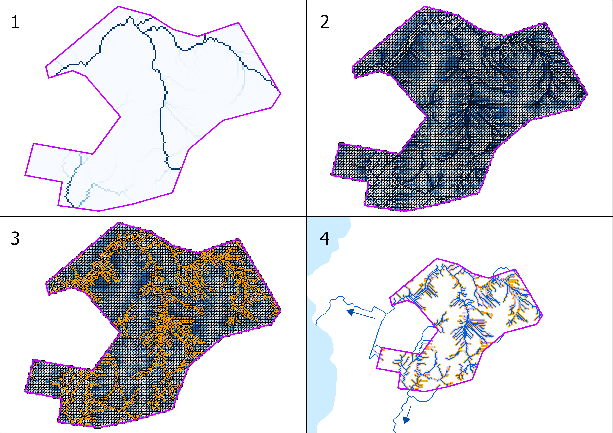

# Beräkna rinnvägar från påverkande område

Beräkning av rinnvägar utgående från påverkande områden görs iterativt per
område genom att spåra nedströms från ett antal punkter inom området som bedöms
sammanfalla med betydande flödesackumulering. Med andra ord kan detta beskrivas
som hur stort det bidragande avrinningsområdet till en punkt måste vara för att
ytvatten ska bildas. Detta tröskelvärde varierar mellan olika delar av landet
och årstider. Beräkningsprocessen kan liknas med att släppa en vattendroppe i
varje sådan punkt och följa dem till de når en recipient.

*Figur 3.4.A. Beräkning av rinnvägar för ett ärendeområde med avrinning till utpekade
recipienter skapat utifrån Markhöjdmodell Nedladdning, grid 1+ © Lantmäteriet.*

I figur 3.4.A illustreras principen för processen att extrahera rinnvägar för
ett ärendeområde med avrinning till utpekade recipienter. Processen kan grovt
delas upp i fyra steg:

1. Klipp flödesackumuleringsraster till ärendeområdet
2. Omvandla klippt flödesackumulering till vektorpunkter (och behåll värde som
  attribut)
3. Filtrera fram punkter med betydande flödesckumulering
4. Beräkna nedströms rinnvägar från utvalda punkter och stanna spårning vid
  träff av recipient

## Efterbearbetning av rinnvägar

- Slå samman rinnvägar från alla avverkningsområden
- Ta bort segment inom ärendeområden
  > Det här steget rensar bort många små segment som ligger nära källpunkterna
  > och påverkar efterföljande beräkningstid och datamängd signifikant
- Rasterisera sammanslagna rinnvägar
- Beräkna rinnvägslutning längs rasteriserade rinnvägar
- Dela upp rinnvägar i segment som är minst `x` m långa
- Buffra segment med `y` m
- Beräkna medelvärde av rinnvägslutning inom varje buffertsegment
- Beräkna medelvärde av sedimenttransportindex inom varje buffertsegment
- Beräkna medelvärde av flödesackumulering inom varje buffertsegment
- Överför beräknad statistik till linjesegment
- Utjämna (smooth) segmenterade rinnvägar med statistik
- Hämta information om recipient
