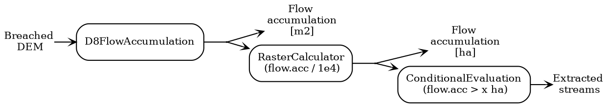
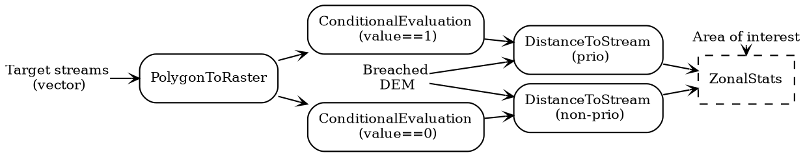

# Beräkna regionala hydrologiska egenskaper

> Med *regional* avses hela det område, t.ex. ett större vattendrags
> avrinningsområde, som verktyget ska kunna utföra beräkningar för. Området
> mostvarar utbredningen för höjdmodellen i föregeånde steg och de beräknade
> egenskaperna kopplas i efterföljande steg till ärendepolygoner och rinnvägar
> inom området.

Följande moment ingår i processen för beräkning av regionala hydrologiska
egenskaper som resulterar i ett antal raster-dataset, d.v.s. att för varje
ytenhet (beroende på höjdmodellens upplösning) presentera information som på
något sätt är kopplat till flödesackumulering. Bearbetningen kan vara relativt
tidskrävande men resultatet för hela (regionala) området kan återanvändas för
återkommande bearbetning av flera avverkningsärendeområden.

- Beräkna flödesackumulering som specfikt avrinningsområde [m2]
- Beräkna flödesackumulering som specfikt avrinningsområde [ha]
- Extrahera vattendrag från flödesackumulering > `x` ha
- Beräkna avstånd till extraherade vattendrag - *nära vattendrag*
- Extrahera markfuktighet *blöt* vid *nära vattendrag*
- Beräkna lutning i varje cell
- Beräkna sedimenttransportindex i varje cell

*Figur 3.2.A. Process för beräkning av olika representationer av flödesackumulering*

## Egenskaper med koppling till recipient

> Recipienter är de vattendrag som det är av intresse att studera avrinning till
> från påverkande avrinningsområden, d.v.s. avvkerkningsområden.

I följande steg beräknas allokering, d.v.s. vilken recipient som berörs av vad,
samt rinnavstånd till recipient. Indata är vektoriserade ytor som representerar
vattendragen och måste ha ett ID samt vara klassade som prioriterat eller icke
prioriterat vattendrag (PRIO=1, PRIO=0).

- Beräkna flödesriktningsraster (D8)
- Maska bort vattenkroppar från flödesriktningsraster
  > Detta steg "inaktiverar" avrinning i maskningsområdet (recipienterna) vilket
  > ger resultatet att allokeringsspårning stannar när en recipient har nåtts.
- Omvandla recipientvektorytor till raster med ID
- Omvandla recipientvektorytor till raster med information om prioritet
- Separera prio-raster i två raster - prio, ej prio
- Beräkna raster med rinnavstånd till prio / ej prio
- Vektorisera allokeringsraster till polygoner med recipient-ID
- Hämta information om prioritet från recipientpolygoner till allokeringspolygoner

*Figur 3.2.B. Process för beräkning av allokering och rinnavstånd till recipienter*