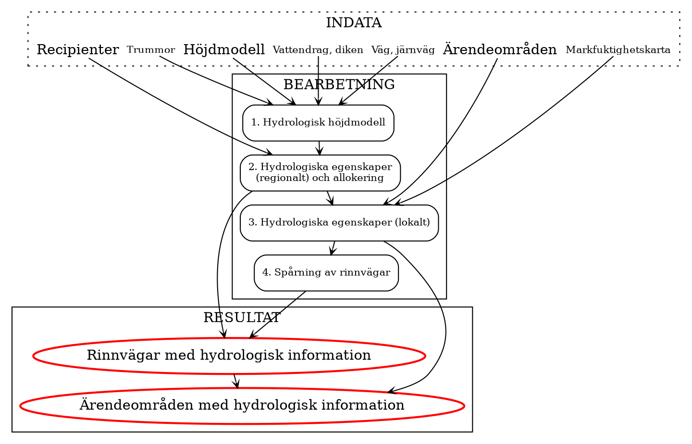

# Metodöversikt

Processen för modelleringen kan grovt delas upp i fyra faser enligt nedan.

- [1. Förberedelser av hydrologisk höjdmodell](./prepare_hydrologial_dem.md)
- [2. Beräkna regionala hydrologiska egenskaper](./calculate_regional_hydrology.md)
- [3. Beräkna zonstatistik inom varje påverkande område](./zonal_statistics.md)
- [4. Beräkna rinnvägar från påverkande område](./calculate_flowpaths.md)

