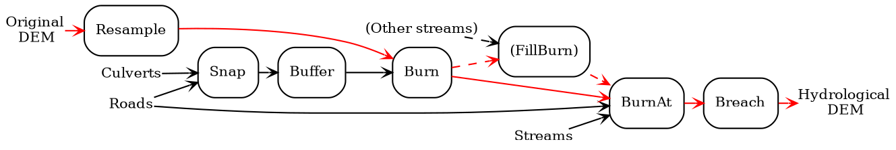
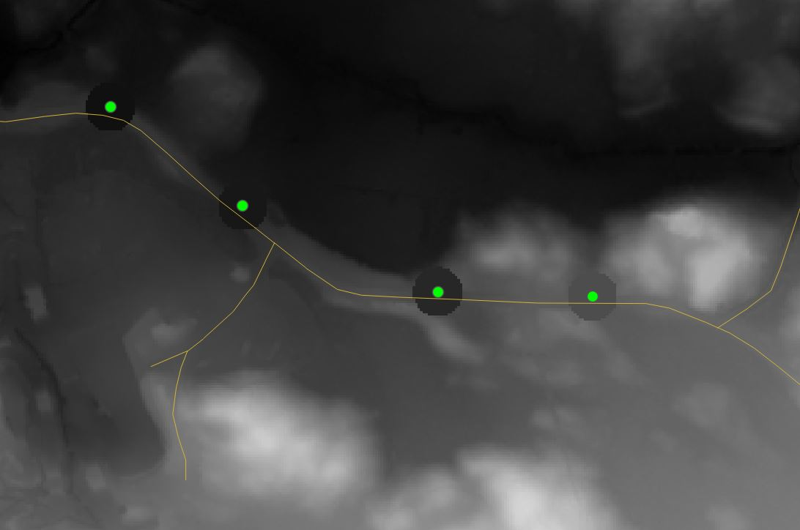

# Förberedelser av hydrologisk höjdmodell

För att kunna göra hydrologiska analyser med ett tillfredställande utfall behöver höjdmodellen bearbetas i ett antal steg.

*Figur 3.1.A. Flödesschema över de steg som ingår i bearbetning av den hydrologiska höjdmodellen*

## Omvandla upplösning/cellstorlek

Markhöjdmodeller i gridformat (raster) med upplösningar <= 1 m ger en hög
detaljrikedom men ofta är det lämpligt att omvandla höjmodellen till en grövre
upplösning då beräkningarna görs snabbare på större och färre raster-celler.
Även om beräkningskraft och hastighet inte är ett problem kan upplösningen ha
betydelse för modellering och beskrivning av hydrologin. En grövre upplösning
skulle möjligen bättre kunna representera de generella rörelserna av både
ytvatten och ytligt grundvatten.

## Bränna in passager över vägar vid kända vägtrummor

I en opreparerad höjdmodell utgör bankar och diken, vid vägar och järnvägar,
barriärer för de rinnvägar som ska modelleras. I verkligheten passerar vattnet
genom vägar och järnvägar via trummor. För att simulera detta kan barriärerna
brytas upp där vi känner till att det finns trummor. Vägtrummor som punkter
förankras till väglinjer och buffras sedan till cirklar med en given radie. Inom
varje cirkel sänks höjdmodellen till det minsta höjdvärdet inom cirkeln.

*Figur 3.1.B. Inom cirkulära zoner runt kända trummor sänks höjdmodellen till
den lägsta nivån för att skapa passage för rinnvägar genom väg och järnväg.
Vektordata från Terrängkartan © Lantmäteriet och Vägtrummor punkter geografisk
vy (Trafikverket). Bakgrundskarta: Markhöjdmodell Nedladdning, grid 1+ ©
Lantmäteriet*

## Bränna in passager över vägar vid kända vattendrag

Även större vattendrag, från t.ex. en topografisk karta, kan bli "blockerade" i
höjmodellen där de passerar en väg- eller järnvägsbro. Vattnets passage i de här
korsningarna kan brännas in på liknande sätt som för trummor men där istället
vattendragens kända väg används för att hitta skärningspunkter med väg- och
järnvägslänkarna. Se exempel i
[Whitebox-manualen](https://www.whiteboxgeo.com/manual/wbt_book/available_tools/hydrological_analysis.html#BurnStreamsAtRoads).

## Bränna in kända diken från dikeskartering

För att ytterligare komplettera detaljgraden i den hydrologiska höjdmodellen så
är det lämpligt att integrera en kartering av diken i skogsmark i höjdmodellen.
Dikena, som är vektoriserade, "bränns" in i höjdmodellen med metoden
[FillBurn](https://www.whiteboxgeo.com/manual/wbt_book/available_tools/hydrological_analysis.html#FillBurn).

## Eliminera sänkor med bryta-fyll-metoden

Det sista steget i förberedelser av den hydrologiska höjdmodellen är att skapa
kontinuerliga rinnvägar genom att i första hand "bryta" ut en väg från en sänka
till en lägre punkt i närheten och i andra hand fylla upp sänkor. Mer
information om den här metoden finns bl.a. i
[Whitebox-manualen](https://www.whiteboxgeo.com/manual/wbt_book/available_tools/hydrological_analysis.html#BreachDepressions).

De här verktyget använder metoden `BreachDepressions` men författaren
rekommenderar istället att använda varianten `BreachDepressionsLeastCost`.
Skillnader i utfallet har inte studerats inom ramen för det här projektet.
