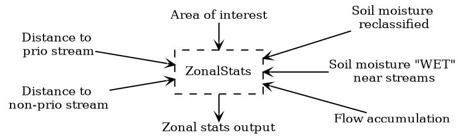

# Beräkna zonstatistik inom varje påverkande område

- Beräkna kortaste rinnsträckan till både prioriterade och icke-prioriterade vatten
- Beräkna statistik för markfuktighetskarta
- Beräkna maximal flödesackumulering

