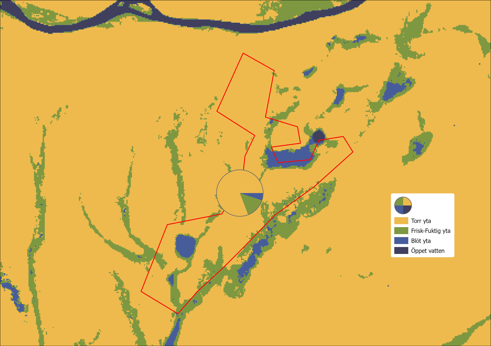

## Arealer och andelar av markfuktighetsklasser inom ärendeområden

Inom ärendeområden kan yta som utgörs av markfuktighetskartans olika klasser
summeras. Förekomst av klasserna summeras var för sig, både som absolut mått
(m2) och som andel av områdets totala yta. De fyra klasserna är:

- Torr
- Frisk-fuktig
- Blöt
- Öppet vatten

*Figur 4.1.3.A. Arealer av de olika markfuktighetsklasserna infom ett område
summeras och redovisas. Resultat och bakgrundsbild skapat utifrån SLU
Markfuktighetskarta.*