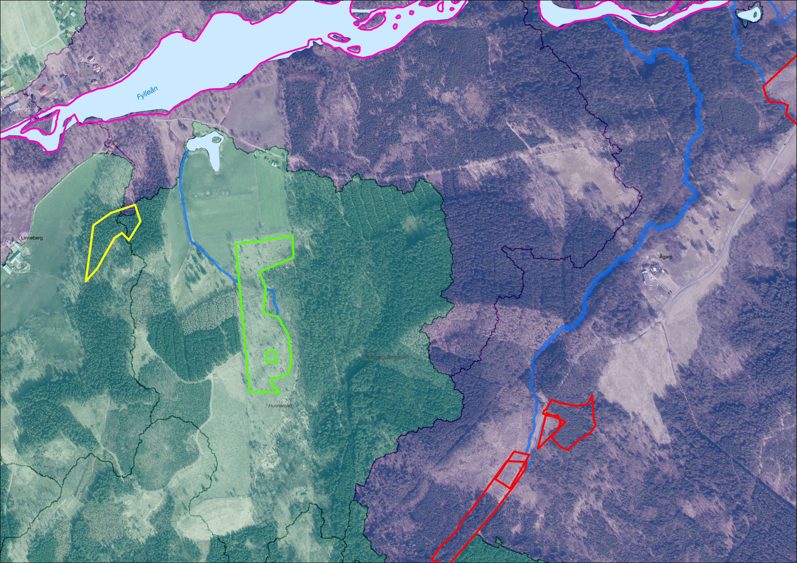

# Avrinning till prioriterat vatten (PV)

Om värdet på egenskapen är **Ja** indikerar detta att avrinning från området når
en PV-recipient via en eller flera rinnvägar i landskapet nedströms. Om
rinnvägarna i verkligheten för strömmande vatten beror i sin tur på om
flödesackumulering är tillräckligt stor i kombination med andra faktorer som
t.ex. nederbörd.

Om värdet är **Nej** innebär det att modellen har stannat spårning nedströms när
en vattenkropp som är icke-PV påträffats, samtidigt som PV inte har påträffats
längs rinnvägar i någon annan riktning. Det kan ändå finnas konnektivitet med
PV *via* icke-PV som spårning stannat i, vilket i praktiken innebär att icke-PV
agerar som buffertreservoar (se exempel i figur 4.1.1.A).

Om bedömning saknas betyder det att flödesackumulering inom aktuellt område inte
överstiger det tröskelvärde som ges till modellen för att bestämma när
ytavrinning bildas.

*Figur 4.1.1.A. Ärendeområden allokeras till recipient med hjälp av
delavrinningsområden. Avrinning från grönt område slutar i icke-PV medan rött
når PV. Gult område överlappar tre delavrinningsområden, varav ett till PV, men
flödesackumulering är inte tillräckligt stor. Resultat skapat utifrån
Markhöjdmodell Nedladdning, grid 1+ © Lantmäteriet. Bakgrundsbild: Topografisk
webbkarta Visning, skiktindelad och Ortofoto färg, 0.5 m © Lantmäteriet.*
