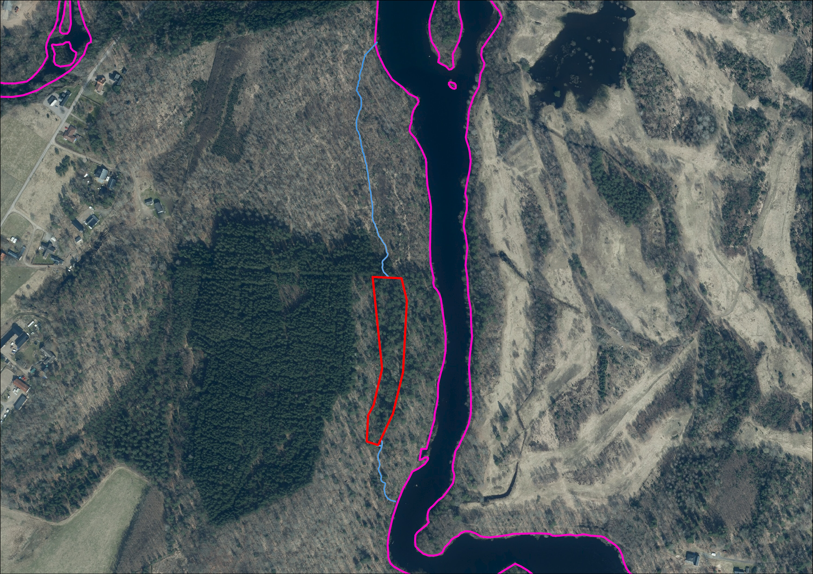
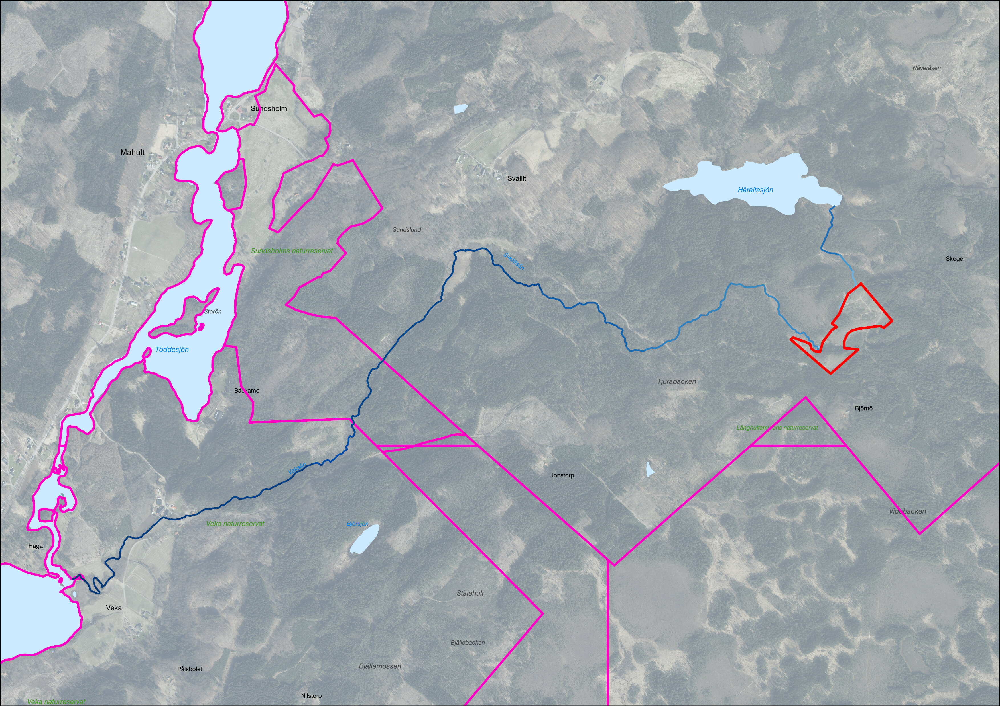

# Kortaste rinnsträcka till PV / icke-PV

Inom varje ärendeområde beräknas den kortaste rinnsträckan till både PV- och
icke-PV-recipienter. Ibland finns det flera rinnvägar till samma recipient men
det är enbart det kortaste avståndet som redovisas. För fall där avrinning inte
sker till PV respektive icke-PV, p.g.a. låg flödesackumulering, redovisas ingen
rinnsträcka.

*Figur 4.1.2.A. Avrinning från ett avverkningsområde sker via två vägar till samma
recipient. Den kortaste rinnsträckan (södra) redovisas kopplat till ärendet.
Resultat skapat utifrån Markhöjdmodell Nedladdning, grid 1+ © Lantmäteriet.
Bakgrundsbild: Topografisk webbkarta Visning, skiktindelad och Ortofoto färg,
0.5 m © Lantmäteriet.*

*Figur 4.1.2.B. Avrinning från ett avverkningsområde sker till både PV och
icke-PV. Den kortaste rinnsträckan för respektive recipient redovisas kopplat
till ärendet. Resultat skapat utifrån Markhöjdmodell Nedladdning, grid 1+ ©
Lantmäteriet. Bakgrundsbild: Topografisk webbkarta Visning, skiktindelad och
Ortofoto färg, 0.5 m © Lantmäteriet.*
