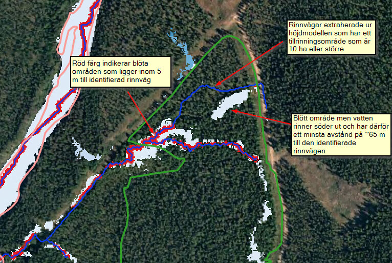

# Blöt yta nära vattendrag

Ytor inom ärendeområdet som är klassade som ***blöt*** (ej *öppet vatten*)
enligt markfuktighetskarta och som sammanfaller med vattendrag (eller sannolik
förekomst av strömmande vatten) bedöms utgöra en betydande risk vid körskador.

För att kvantifiera förekomsten av en sådan risk måste först identifiering av
vattendrag, som passerar området, ske. Extrahering av sådana vattendrag görs
från höjdmodell baserat på punkter där flödesackumulering överstiger ett bestämt
tröskelvärde (t.ex. 10 ha). Därefter beräknas en *X* meter (5 m i exempel nedan)
bred buffertzon längs vattendragen, men enbart där blöt mark förekommer. Den
resulterande ytan (m2) summeras inom området och utgör värdet för denna
egenskap.

*Figur 4.1.4.A. Blöt yta nära vattendrag. Resultat skapat utifrån SLU
Markfuktighetskarta och Markhöjdmodell Nedladdning, grid 1+ © Lantmäteriet.
Bakgrundsbild: Topografisk webbkarta Visning, skiktindelad och Ortofoto färg,
0.5 m © Lantmäteriet.*
