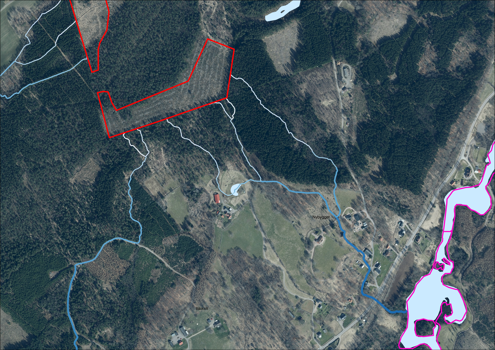

# Flödesackumulering

Med flödesckumulering menas i det här sammanhanget samma sak som *specifikt
avrinningområde*, d.v.s. det område som finns uppströms en given punkt och
bidrar med att fånga upp ytavrinning som leds till punkten. Varje pixel i
höjdmodellen kan vara en sådan punkt och därmed kan också flödesackumulering
beräknas för varje pixel i höjdmodellen. Måttet redovisas i enhet hektar (ha).

*Figur 4.2.4.A. Längsgående medelvärde av flödesackumulering inom en smal
buffert längs rinnvägarna beräknas och visualiseras bäst i logaritmisk skala.
Resultat skapat utifrån Markhöjdmodell Nedladdning, grid 1+ © Lantmäteriet.
Bakgrundsbild: Topografisk webbkarta Visning, skiktindelad och Ortofoto färg,
0.5 m © Lantmäteriet.*
