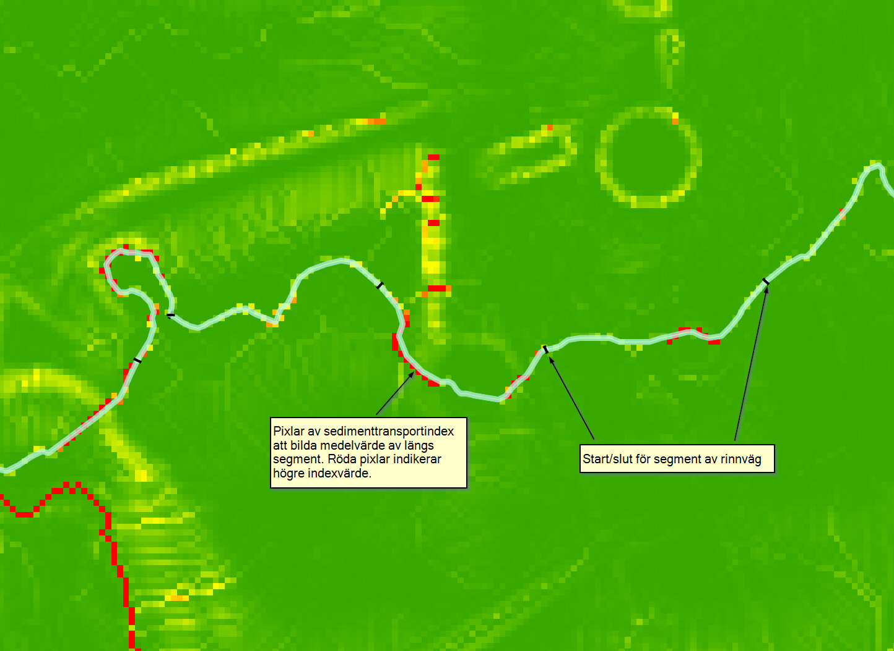

# Sedimenttransport

Sedimenttransportindex är ett mått på transportkapaciteten för ytavrinning som
beräknas utifrån en höjdmodell. Måttet är enhetslöst och därför i sammanhanget
bara användbart för att avgöra om det i en given punkt finns förutsättningar för
mer eller mindre transport i jämförelse med en annan punkt i landskapet. Det kan
användas istället för en längd-lutning-faktor för avstånd mindre än 100 m och
lutningar mindre än 14 grader. Beräkningar i den här modellen görs med
rasterpixelstorlek på max ett fåtal meter och bör därför gälla. Indexet
beräknas med följande formel:

> STI = (m + 1) × (A_s / 22.13)^m × sin(B / 0.0896)^n

Där *A_s* är det specifika avrinningsområdet, *m* är exponent för bidragande
avrinningsområde (vanligtvis 0.4), *B* är lutningen och *n* lutningsexponent (vanligtvis 1.4).

Förenklat säger sambandet att ju högre avrinningsområde och ju större lutning
(upp till ~16 grader) desto större blir erosionsrisken och sedimenttransporten.

**Längs varje rinnvägssegment beräknas ett medelvärde för sedimenttransportindex.**

*Figur 4.2.2.A. Medelvärde av sedimentransportindex beräknas för varje segment
av rinnvägen. Resultat skapat utifrån Markhöjdmodell Nedladdning, grid 1+ ©
Lantmäteriet.*
