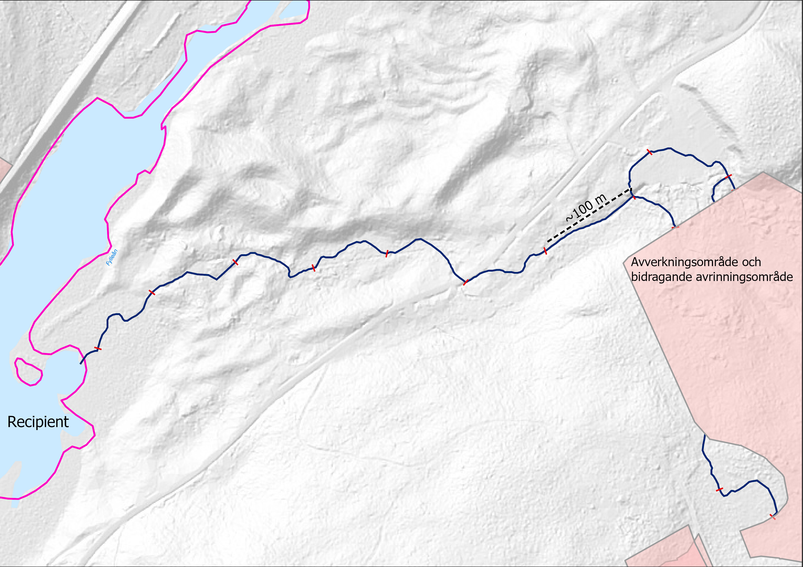

# Segmentindelning, avrinningsområde och recipient

Rinnvägar nedströms ett ärendeområde delas upp i segment om valfritt antal meter
i den mån det är möjligt. Syftet med uppdelningen är att möjliggöra statistisk
sammanställning av karaktärer för rinnvägarna som t.ex. lutning,
sedimenttransport och flödesackumulering. Figur 4.2.1.A visar ett exempel på hur
en sådan segmentindelning kan se ut. Identiteter för ärendeområdet där rinnvägen
startar och recipienten där rinnvägen slutar redovisas i attribut för varje
segment.

*Figur 4.2.1.A. Segmenterad rinnväg från ett avverkningsområde till en recipient
skapat utifrån Markhöjdmodell Nedladdning, grid 1+ © Lantmäteriet.
Bakgrundsbild: Topografisk webbkarta Visning, skiktindelad och Markhöjdmodell
Nedladdning, grid 1+ © Lantmäteriet.*
