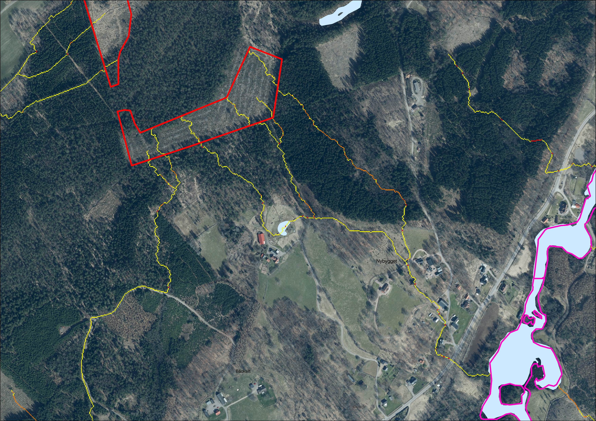
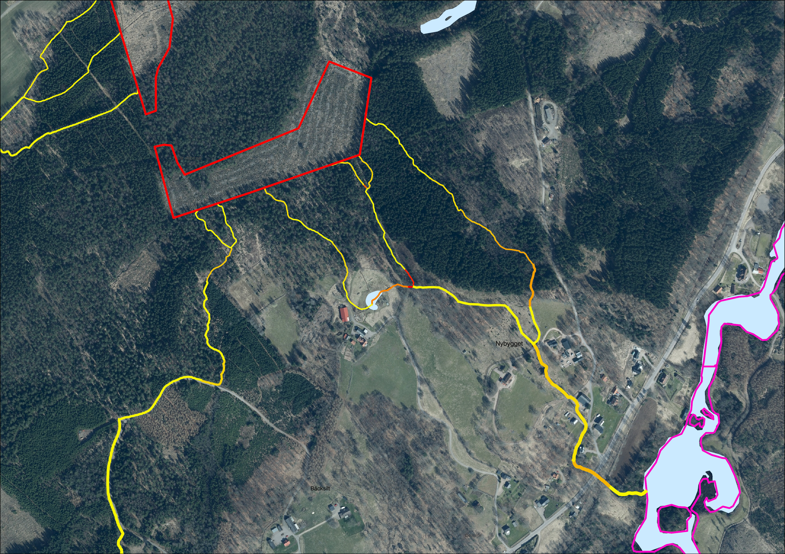

# Lutning

På samma sätt som medelvärde för sedimenttransportindex beräknas per
rinnvägssegment, beräknas även medelvärde för längsgående lutning och som
redovisas i absoluta mått i form av grader.

*Figur 4.2.3.A. Lutning per pixel beräknas längs rinnvägar identifierade vid
spårningen nedströms. Resultat skapat utifrån Markhöjdmodell Nedladdning, grid
1+ © Lantmäteriet. Bakgrundsbild: Topografisk webbkarta Visning, skiktindelad
och Ortofoto färg, 0.5 m © Lantmäteriet.*

*Figur 4.2.3.B. Medelvärde av lutning längs varje segment beräknas och
sammanställs på segmentets vektorrepresentation. Resultat skapat utifrån
Markhöjdmodell Nedladdning, grid 1+ © Lantmäteriet. Bakgrundsbild: Topografisk
webbkarta Visning, skiktindelad och Ortofoto färg, 0.5 m © Lantmäteriet.*
